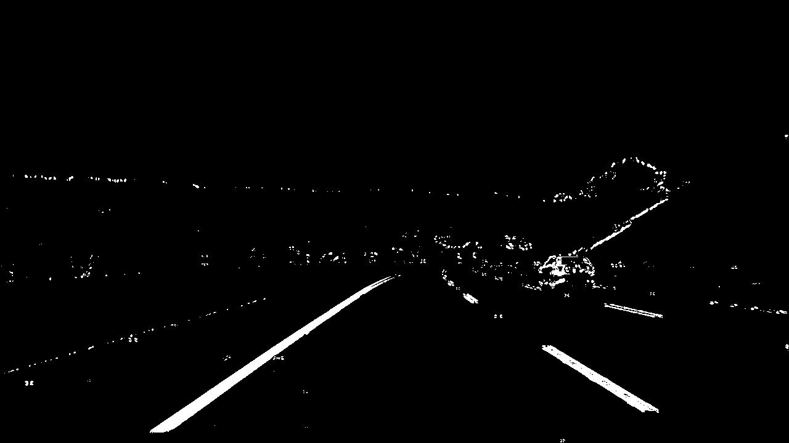

# Advanced Lane Finding


[](http://www.udacity.com/drive)


## Table of Contents


<!-- TOC -->

- [Overview](#overview)
- [Description](#description)
    - [Implementation Details](#implementation-details)
- [Usage](#usage)
- [Dependencies](#dependencies)
- [Limitations](#limitations)

<!-- /TOC -->

---


## Overview

In this project, the goal is to write a software pipeline to identify the lane boundaries and compute the lanes curvature radius as well as the offset from the center of the lane in a video stream, as a part of Udacity's Self-Driving Cars ND.


The files in this project are:

##### [getCalibrationMatrix.py](https://github.com/HossamKhalil-hub01/CarND-P2--AdvancedLaneLinesDetection/blob/master/getCalibrationMatrix.py):

Python script that computes the calibration matrix using chessboard image, and saves the resulting variables in [calib_mtx.p](https://github.com/HossamKhalil-hub01/CarND-P2--AdvancedLaneLinesDetection/blob/master/camera_cal/calib_mtx.p) file

##### [grad_color_combo.py](https://github.com/HossamKhalil-hub01/CarND-P2--AdvancedLaneLinesDetection/blob/master/grad_color_combo.py):

Contains functions to perform different binary thresholdings (gradient and color) to use for different masking combinations.

**Note**:  There is no need to run this code more than once for the same camera.


##### [Advanced_LaneLines.py](https://github.com/HossamKhalil-hub01/CarND-P2--AdvancedLaneLinesDetection/blob/master/Advanced_LaneLines.py) :
the implementation of the pipline, it uses the grad_color_combo.py and contains the main processing function `Lane_detection()` which can be used for processing an image or a video stream.

[test_images](https://github.com/HossamKhalil-hub01/CarND-P2--AdvancedLaneLinesDetection/tree/master/test_images) and   [test_vids](https://github.com/HossamKhalil-hub01/CarND-P2--AdvancedLaneLinesDetection/tree/master/test_vids) folders have multiple test images and test videos, the result of processing each element can be found in [output_images](https://github.com/HossamKhalil-hub01/CarND-P2--AdvancedLaneLinesDetection/tree/master/output_images) and [output_vids](https://github.com/HossamKhalil-hub01/CarND-P2--AdvancedLaneLinesDetection/tree/master/output_vids) respectively.

---
## Description


Detection is done through several steps any of which can be used individually :

1. Undistort input image using the calibration matrix.
2. Extract features using Sobel gradients and HLS color space thresholding.
3. Transform the image into a bird's-eye view perspective.
4. Lane fitting using sliding window and searching around previous detected lanes for more efficient searching.
5. Smoothing lanes over several frames to reduce jittering.
6. Compute curvature radius and vehicle's offset from the center of the lane
7. Transform the detected lane back to the original image view and draw the results on the image.


### Implementation Details

The following image is used as an illustration, the generated resutls can be found in [output_images/test3](https://github.com/HossamKhalil-hub01/CarND-P2--AdvancedLaneLinesDetection/tree/master/output_images/test3).


**1. Camera Calibration**:

Camera calibration is implemented in [getCalibrationMatrix.py](https://github.com/HossamKhalil-hub01/CarND-P2--AdvancedLaneLinesDetection/blob/master/getCalibrationMatrix.py) file which imports all chessboard images in [camera_cal](https://github.com/HossamKhalil-hub01/CarND-P2--AdvancedLaneLinesDetection/tree/master/camera_cal) folder then extracts the corners of each image to form the `imgpoinst`, assuming that the chessboard is placed on a flat surface then the `objpoints` are a mesh grid of (x,y,0) representing the object corners in real world coordinates.
using these points the calibration matrix and distortion coefficient are computed.

The output camera matrix and distortion coefficient are then stored as [calib_mtx.p](https://github.com/HossamKhalil-hub01/CarND-P2--AdvancedLaneLinesDetection/blob/master/camera_cal/calib_mtx.p) file to be used in the main pipline script to undistort images.


*The Undistorted Image*


**2. Color and Gradient Thresholding Thresholding**

The binary thresholding is implemented in [grad_color_combo.py](https://github.com/HossamKhalil-hub01/CarND-P2--AdvancedLaneLinesDetection/blob/master/grad_color_combo.py) file, where all the individual functions needed for the combination are implemented such as (Sobel x operator , Sobel y operator , HLS Color space thresholding,.etc)

The thresholding is a combination between gradient and color thresholding using Sobel operator for x and y directions, and color thresholding depending S and V channels values in HLS color space.

The threshloding function is `grad_color_combo()` which is imported to the main pipline script using the following line:

`import grad_color_combo as thresh `


*Thresholded Binary Image*



**3. Perspective Transformation (Bird's-Eye View)**

The binary thresholding is implemented in [Advanced_LaneLines.py](https://github.com/HossamKhalil-hub01/CarND-P2--AdvancedLaneLinesDetection/blob/master/Advanced_LaneLines.py) file in `BirdsEye_view()` function.
The image is warped using perspective transformation.
The selected source and destination points for transformation are:

```python
src = np.array ([
    [int(x1_pos_ratio*w),h-1],
    [int(x2_pos_ratio*w),int(y_pos_ratio*h)],
    [int((1-x2_pos_ratio)*w),int(y_pos_ratio*h)],
    [int((1-x1_pos_ratio)*w),h-1]
],np.float32)

dst = np.array ([
    [x_ratio*w,h-1],
    [x_ratio*w,0],
    [((1-x_ratio)*w),0],
    [((1-x_ratio)*w),h-1]
],np.float32)
```
where `h` and `w` are the dimensions of the image ,`x1_pos_ratio` , 'x2_pos_ratio' , `y_pos_ratio` and `x_ratio` are factors with respect to the image dimension.


*Bird's-Eye View Image*


**4. Lane-lines Detection and Lane fitting**

1. Lane-lines Detection:

For lane-lines detetction two functions are used:
- `find_lane_pixels()` : Which uses the sliding window method to detect lines in case of no prior fits have occured.
first histogram is used to identify the intial window positions and then sliding window approach is used to detect onlythe relevant pixels in the frame.

-  `search_around_poly()` : When a lane has been fitted in previous frames it's ineffcieint to search the entire frame again, so this function is used to search within a margin of the prior fitted lines as follows:

```python
left_ind = ((pix_x > (prev_left_fit[0]*pix_y**2) + (prev_left_fit[1]*pix_y) + prev_left_fit[2] - margin)&\
            (pix_x < (prev_left_fit[0]*pix_y**2) + (prev_left_fit[1]*pix_y) + prev_left_fit[2] + margin))


right_ind = ((pix_x > (prev_right_fit[0]*pix_y**2) + (prev_right_fit[1]*pix_y) + prev_right_fit[2] - margin)&\
             (pix_x < (prev_right_fit[0]*pix_y**2) + (prev_right_fit[1]*pix_y) + prev_right_fit[2] + margin))

```
where `right_ind` and `left_ind` are the new detected pixels.

2. Lane Fitting

After the lines pixels are detected using one of the previous methods, the pixels positions are then fed to the `lane_fitting` function to fit a second-degree polynomial for each line.

depending on the avilability of a previous fits it uses  eathier one of the previous functions to generate the pixels positions

- In case of previous fit is found:

```python

if (prev_available): #Previous lane fit found
    #Find new lane pixels position
    leftx, lefty, rightx, righty = search_around_poly(binaryImg, leftline, rightline)

```

- else:

```python

else :    #First frame (use sliding windows)

    # Find lane pixels position
    leftx, lefty, rightx, righty,img = find_lane_pixels(binaryImg)

```
where `leftx`  and `lefty` are the pixels positions for the left line and `rightx` and `righty` are the positions for the right line

in case of the sliding-window approch another variable `img` is used to visualize the sliding-window approach.

At the main pipline function `Lane_detection()` in step 4.2 the lane is smoothed by averaging the fitting coefficients of the last 5 frames
while removing the oldest fit each step as follows :

```python

#Number of frames to be averaged
Number_of_frames = 5

#delete the oldest value in the fits list if the length > Number of frames
if len(leftline_obj.recent_fits) > Number_of_frames:

    leftline_obj.recent_fits.pop(0)


if len(rightline_obj.recent_fits) > Number_of_frames:

    rightline_obj.recent_fits.pop(0)

#Average the last N coefficients
leftline_obj.best_fit =  np.average((leftline_obj.recent_fits),axis = 0)
rightline_obj.best_fit =  np.average((rightline_obj.recent_fits),axis = 0)

```
where `leftline_obj` and `rightline_obj` are objects from the `line()` class implemented to store different data needed for the operation.

*Fitted Lane-lines Image*


**5. Radius of Curvature and Vehicle's Deviation from Center**
The computation for curvature radius and center offset are implemented in `compute_curvatureAndOffset()`

1. Offset Computations:
The center of the lane is computed by finding the mid-point between the right and left lines at the very bottom (as close to the vehicle as possible), while the vehicle center is assumed to be the center of the image:

```python

#Get x position for left and right lanes at the max bottom of the image
xleft  = left_fit[len(left_fit)-1]
xright = right_fit[len(right_fit)-1]

#Lane Center
lane_center = ((xright-xleft)/2) + xleft
img_center = width/2

```
then the offset is just the difference between the two values.
this offset is in pixels, so in order to compute it in meters the offset is then multiplied by a factpr `xm_per_pix`

2. Radius of Curvature

Given the fitted lines coefficients the radius curvature per line can be computed using the following equation:


for the conversion from pixels to meters the coefficients are calculated  using x and y positions of pixels multiplied by the conversion ratios `ym_per_pix` and `xm_per_pix`

and then the curvature radius is computed at the very bottom of the image (hence at y = max(y) value)

- Computation Block:

```python

#Fit the polynomial in meters
left_fit_m = np.polyfit(y*ym_per_pix , left_fit*xm_per_pix , 2)
right_fit_m = np.polyfit(y*ym_per_pix , right_fit*xm_per_pix , 2)

#Calculate for the largest y value (bottom half)
y_eval = np.max(y)

#Compute the radius of the curve at the max y point using curvature  radius eqn.
#Calculation of the left lane
left_curvR  = (np.sqrt((1+((2*left_fit_m[0]*y_eval*ym_per_pix)+left_fit_m[1])**2)**3))/(np.absolute(2*left_fit_m[0]))
#Calculation of the right lane
right_curvR = (np.sqrt((1+((2*right_fit_m[0]*y_eval*ym_per_pix)+right_fit_m[1])**2)**3))/(np.absolute(2*right_fit_m[0]))

```
The mean of both curvatures radius is then computed to be displayed on the final results.
**6. Plotting the Results**

- In `drawResults()` function:
The lane is plotted using `cv2.fillpoly` function in a colored version of the warped image.
Then warped image is transformed back to the original view using the inverse of the transformation matrix.

```python

#Draw the lane in warped image (in blue)
cv2.fillPoly(color_warp, np.int_([poly_pts]), (0,0, 255))

#Warp the image back to the original perspective (using the transform matrix inverse(mtx))
unwarp = cv2.warpPerspective(color_warp, inv(mtx), (undistImg.shape[1], undistImg.shape[0]))

```
Finally the colored unwarped image is added to the original undisorted.

- In the main pipline `Lane_detection()` function:
In step 7. after calling `drawResults()` function to receive the original image combined with filled poly, `cv2.putText` function is used to place the offset and curvature radius data on the image to acheive the final result

*Final Result*


**Note**: For the video stream demo please check the [project_video](https://github.com/HossamKhalil-hub01/CarND-P2--AdvancedLaneLinesDetection/tree/master/output_vids)

## Usage

Use the `Lane_detection()` function and input the image or the video frame to be processed, if it is required to use the full pipline. otherwise you can use any step of the process individually.

At the very last section in `Advanced_LaneLines.py` a demo is included to process an example image from [test_images](https://github.com/HossamKhalil-hub01/CarND-P2--AdvancedLaneLinesDetection/tree/master/test_images) and another to process the project video from [test_vids](https://github.com/HossamKhalil-hub01/CarND-P2--AdvancedLaneLinesDetection/tree/master/test_vids) .

**Note** : The `Lane_detection()` function has a visualization for each step. Feel free to uncomment the visualization section of any stage to visuzlize and save the results.


## Dependencies

* [Python 3](https://www.python.org/downloads/)
* [openCV 3.0](https://opencv.org/opencv-3-0/)
* [matplotlib](https://matplotlib.org/)
* [numpy](https://numpy.org/)
* [moviepy](https://zulko.github.io/moviepy/)


## Limitations
As it performs quite well in normal conditions, but the detection can fail to track two cases :

* Extreme Curvature.
* Extreme lighting conditions and variations

That can be noticed if you tried to process [harder_challenge_video](https://github.com/HossamKhalil-hub01/CarND-P2--AdvancedLaneLinesDetection/blob/master/test_vids/harder_challenge_video.mp4) or [challenge_video](https://github.com/HossamKhalil-hub01/CarND-P2--AdvancedLaneLinesDetection/blob/master/test_vids/challenge_video.mp4).

### Ideas:

* To enhance the thresholding technique to be more robust
* Modify the lines detection techinque to handel extreme curvatures
